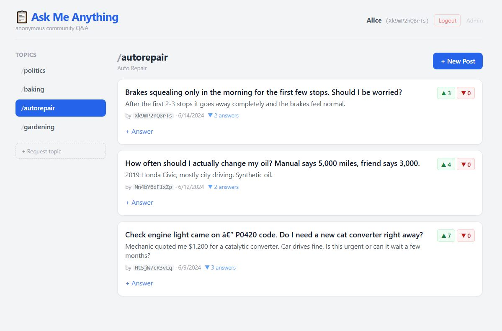
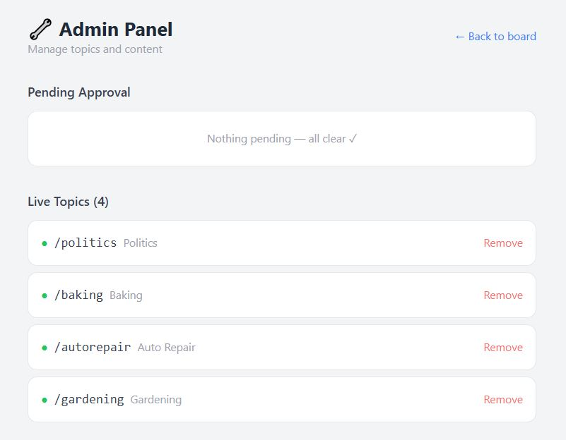
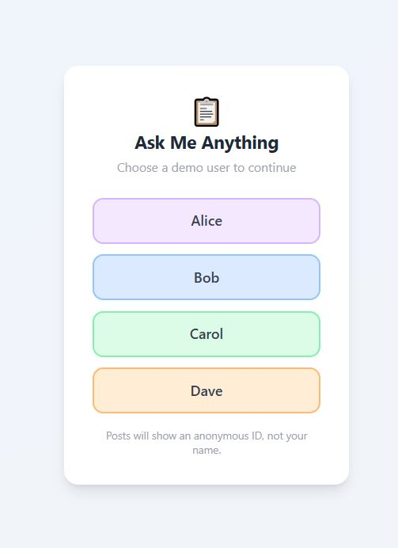

# Ask Me Anything — Anonymous Community Q&A

> Ask anything. Answer honestly. No account required to read.

Ask Me Anything is a single-file anonymous bulletin board, built as a proof-of-concept. Users post questions and answers under a randomised ID: no username, no email, no history tied to a real identity. The idea is a board where people can ask things they'd be too embarrassed or afraid to ask with their name attached — health questions, money stuff, relationship problems, anything where putting your name on it is what stops you.

This repo is the tech demo. The entire app, Flask backend and React frontend, lives in one Python file.

---

| Board | Admin | Login |
|-------|-------|-------|
|  |  |  |

---

## Quick Start

```bash
pip install flask
python bulletin_board.py
```

| URL | Purpose |
|-----|---------|
| `http://localhost:5000/` | Main board |
| `http://localhost:5000/user` | Demo user login |
| `http://localhost:5000/admin` | Admin panel (topic moderation) |

To reset all data: delete `board_data.json` and restart.

---

## Features

- **Fully anonymous posting** — every post and answer shows a random ID, not a real name
- **Topic-based board** — posts live in topics (Politics, Baking, Auto Repair, etc.)
- **Topic request and approval** — any logged-in user can request a new topic; an admin approves or rejects it
- **Up/down voting** — on posts and answers; voting the same direction twice undoes the vote
- **Answer threading** — each post can have multiple answers, collapsible in the UI
- **Zero sign-up** — demo accounts are pre-seeded; no registration needed to try it
- **Zero build step** — React, Tailwind, and Babel load from CDN; just `python bulletin_board.py`

---

## How the Demo Works

The app ships with four pre-seeded users: **Alice**, **Bob**, **Carol**, and **Dave**. Each has a fixed random anonymous ID (e.g. `Xk9mP2nQ8rTs`).

When someone posts or answers, only their `anon_id` is visible, not their name. This lets you walk through the full interaction flow across four browser tabs without setting up real accounts.

### Walkthrough

1. Open `http://localhost:5000/user` in four browser tabs
2. Log in as Alice, Bob, Carol, and Dave (one per tab)
3. In Alice's tab: go to **Baking**, post "What's the best sourdough hydration?"
4. In Bob's tab: find the post, click **Answer**, reply "I use 75% hydration"
5. In Carol's tab: upvote Bob's answer
6. In Dave's tab: click **+ Request topic** and submit "Gardening"
7. Open `http://localhost:5000/admin`, approve Gardening — it appears in the sidebar
8. Notice all posts show anonymous IDs, not real names

---

## Admin and Moderation

The admin panel is at `/admin`. In this POC it has no authentication — anyone can access it. That's the first thing to fix before a real deployment (see the hosting checklist below).

### What admins can do

**Topic management:**
- View all topics, including ones submitted by users but not yet approved
- Approve a pending topic — it immediately appears in the sidebar for all users
- Reject a pending topic — the record is deleted
- Remove a live topic at any time

The approval queue is where most day-to-day moderation happens. Any logged-in user can submit a topic name, so the queue acts as a gate against spam and off-topic categories. An admin reviews and clicks approve or reject.

### What's missing (POC gaps)

There is no post-level moderation. An admin cannot hide or delete individual posts or answers. For a board that handles sensitive topics, that's the most important gap to close before going live. The roadmap item "Add post-level moderation" covers it.

### Moderation approach

The board is intentionally open on the posting side. Topics require admin sign-off before going live. Posts and answers do not — the goal is for people to get answers without a delay or a gatekeeper.

Voting handles quality passively: useful answers get upvoted, weak ones don't. Future versions should add a flagging mechanism so users can surface bad content without the admin having to read every post.

This is a deliberate tradeoff. It means some bad content will appear briefly. If that's unacceptable for your community, a pre-moderation queue for posts is the safer path.

---

## Path to Hosting

The app runs fine locally. Getting it ready for public hosting means working through these steps, roughly in order.

### 1. Move the secret key to an environment variable

The Flask session cookie is signed with `secret_key`. The hardcoded value means anyone with the source code can forge session cookies.

```python
# bulletin_board.py
app.secret_key = os.environ.get("SECRET_KEY") or "dev-only-do-not-use-in-prod"
```

Generate a key with `python -c "import secrets; print(secrets.token_hex(32))"` and set it in your hosting environment.

### 2. Replace JSON storage with a real database

Every request reads and writes the entire `board_data.json` file. That works for a single user but will corrupt data under any real concurrency. SQLite is the easiest fix:

- Keep the `load()` / `save()` interface
- Replace the JSON read/write with SQLite queries
- For higher traffic, swap to Postgres (SQLAlchemy makes this straightforward)

### 3. Add admin authentication

`/admin` is currently open to anyone. Before going live, add a password check or a separate admin session:

```python
ADMIN_PASSWORD = os.environ.get("ADMIN_PASSWORD")

@app.before_request
def protect_admin():
    if request.path.startswith("/admin") and not session.get("is_admin"):
        return redirect("/admin-login")
```

### 4. Serve with a production WSGI server

Flask's built-in server is single-threaded and not meant for public traffic. Swap it for Gunicorn:

```bash
pip install gunicorn
gunicorn bulletin_board:app --workers 2 --bind 0.0.0.0:8000
```

For HTTPS, put Nginx or Caddy in front and let it handle TLS termination.

### 5. Add input sanitisation

Post and answer content is stored as-is. React escapes output by default, which blocks most XSS, but if you ever add `dangerouslySetInnerHTML` or server-side rendering you'll need explicit sanitisation. Safer to add it now:

```python
import html
post["title"] = html.escape(body.get("title", "").strip())
```

### 6. Add rate limiting

Without it, anyone can flood the board with a basic script. Flask-Limiter handles this with a few lines:

```bash
pip install Flask-Limiter
```

```python
from flask_limiter import Limiter
limiter = Limiter(app, key_func=lambda: request.remote_addr)

@app.route("/api/posts", methods=["POST"])
@limiter.limit("10 per minute")
def create_post():
    ...
```

### 7. Build the React frontend properly

Every visitor's browser currently transpiles JSX from scratch via Babel — roughly 2 seconds on a cold load. For anything beyond a demo, bundle it:

```bash
npm create vite@latest frontend -- --template react
# move the JSX from the HTML string into .jsx files
npm run build
# serve build/ as Flask static files
```

### 8. Deploy

Once the above is done, any standard platform works:

| Platform | Notes |
|----------|-------|
| **Render** | Free tier available; connects to the repo and auto-deploys on push |
| **Railway** | Simple Postgres add-on; good once you've done the DB migration |
| **Fly.io** | Good for Dockerised deploys; global edge |
| **VPS (DigitalOcean, Hetzner)** | Full control; you set up Nginx, Gunicorn, and systemd yourself |

Minimal `Dockerfile` to get started:

```dockerfile
FROM python:3.12-slim
WORKDIR /app
COPY bulletin_board.py .
RUN pip install flask gunicorn
EXPOSE 8000
CMD ["gunicorn", "bulletin_board:app", "--workers", "2", "--bind", "0.0.0.0:8000"]
```

---

## Why So Lightweight?

The single-file, no-build, flat-file-storage approach is a deliberate constraint, not a shortcut.

The goal was to make the concept as forkable and auditable as possible. If someone wants to run this for a small community, evaluate whether the idea works, or hack it into something else entirely, the barrier should be two commands and a text editor — not a Node environment, a Docker setup, a configured database, and a deployment pipeline they don't understand.

There's a real cost to complexity in civic or support tools. The more infrastructure a project requires, the fewer people can actually deploy and own it. A school counsellor running this for students shouldn't need a DevOps background. A community organiser shouldn't need to manage a cloud database.

So the constraints are intentional:

- **One file** — the entire codebase is readable in a single sitting. No hidden logic spread across a dozen modules.
- **No build step** — React and Tailwind load from CDN. Anyone who can read HTML can read the frontend.
- **Flat-file storage** — `board_data.json` is just JSON. You can read it, back it up, migrate it, or inspect it with any text editor.
- **No accounts** — the demo uses pre-seeded users. The anonymity model is visible and simple enough to audit by reading 30 lines of code.

The known limitations section is long precisely because this tradeoff is honest: this architecture doesn't scale, and it's not trying to. It's a working proof of concept that anyone can run today, with a clear migration path when the time comes to grow it.

---

## Architecture Overview

### Single-file design

Everything is in `bulletin_board.py`. That was the explicit goal: no project scaffolding, no `npm install`, nothing beyond `pip install flask`. The file is long. The payoff is that anyone can run it in under a minute.

```
bulletin_board.py      <- backend (Flask) + frontend (React SPA) in one file
board_data.json        <- auto-created on first run; add to .gitignore
```

### Tech stack

| Layer | Technology | Notes |
|-------|-----------|-------|
| Backend | Python 3 + Flask | REST JSON API; server-side sessions via signed cookie |
| Frontend | React 18 (CDN) | No build step; loaded from `unpkg.com` |
| Styling | Tailwind CSS (CDN) | Utility classes only, no config file |
| JSX transpilation | Babel Standalone (CDN) | Transpiles JSX in-browser at runtime |
| Storage | JSON flat file (`board_data.json`) | Fine for a demo; not production-safe |
| Sessions | Flask signed cookie | `secret_key` is hardcoded — see known limitations |

### File structure

| Section | Contents |
|---------|----------|
| Data layer | `DEFAULT_DATA`, `load()`, `save()`, `rand_id()` |
| Flask API | All `/api/*` routes |
| React SPA | `HTML` string — the entire frontend |
| Page routes | Four Flask routes that all serve the same SPA |

---

## API Reference

### Auth

| Method | Path | Body | Description |
|--------|------|------|-------------|
| `GET` | `/api/me` | — | Returns current user object or `null` |
| `POST` | `/api/login` | `{user_id}` | Sets session cookie, returns user |
| `POST` | `/api/logout` | — | Clears session |

### Topics

| Method | Path | Body | Description |
|--------|------|------|-------------|
| `GET` | `/api/topics` | — | Approved topics only |
| `GET` | `/api/topics/all` | — | All topics including pending (admin view) |
| `POST` | `/api/topics` | `{name}` | Creates topic in pending state |
| `POST` | `/api/topics/<tid>/approve` | — | Sets `approved = true` |
| `POST` | `/api/topics/<tid>/reject` | — | Deletes topic entirely |

### Posts and Answers

| Method | Path | Body | Description |
|--------|------|------|-------------|
| `GET` | `/api/posts/<topic_id>` | — | Posts for a topic, newest first |
| `POST` | `/api/posts` | `{topic_id, title, content}` | Creates post (auth required) |
| `POST` | `/api/posts/<pid>/vote` | `{direction: "up"\|"down"}` | Toggle-aware vote on post |
| `POST` | `/api/posts/<pid>/answers` | `{content}` | Adds answer (auth required) |
| `POST` | `/api/posts/<pid>/answers/<aid>/vote` | `{direction: "up"\|"down"}` | Toggle-aware vote on answer |

---

## Data Schema

`board_data.json` is auto-created on first run:

```json
{
  "users": [
    { "id": "u1", "username": "Alice", "anon_id": "Xk9mP2nQ8rTs" }
  ],
  "topics": [
    { "id": "baking", "name": "Baking", "approved": true, "created": "2024-01-01" }
  ],
  "posts": [
    {
      "id": "abc12345",
      "topic_id": "baking",
      "title": "What flour is best for sourdough?",
      "content": "I keep getting a gummy crumb...",
      "anon_id": "Xk9mP2nQ8rTs",
      "user_id": "u1",
      "upvotes": 3,
      "downvotes": 0,
      "created": "2024-01-01T12:00:00",
      "answers": [
        {
          "id": "xyz98765",
          "content": "Bread flour with higher protein content makes a big difference.",
          "anon_id": "Ht5jW7cR3vLq",
          "user_id": "u2",
          "upvotes": 2,
          "downvotes": 0,
          "created": "2024-01-01T12:05:00"
        }
      ]
    }
  ],
  "votes": {
    "abc12345_u2": "up",
    "xyz98765_u3": "up"
  }
}
```

**Vote tracking:** `votes` is a flat dict keyed as `"{target_id}_{user_id}"`. Post and answer objects store only the counts. Voting the same direction twice undoes the vote; switching direction adjusts both counters.

**Anonymous IDs:** Each demo user has one fixed `anon_id`, so their posts are traceable across topics. That's intentional for the demo. In production, generate a fresh ID per post for real anonymity.

---

## Known Limitations

This is a proof-of-concept. Don't deploy it as-is.

| Issue | Impact | Fix |
|-------|--------|-----|
| JSON flat-file storage | No concurrency safety; full read/write per request | Replace `load()`/`save()` with SQLite or Postgres |
| No admin authentication | `/admin` is public | Password or session check before any admin route |
| No post-level moderation | Can't hide or delete individual posts | Add hide/flag/delete endpoints and admin UI |
| In-browser Babel transpilation | ~2s cold load; not suitable for real traffic | Vite + proper React build |
| Hardcoded `secret_key` | Sessions can be forged if the key leaks | Move to environment variable |
| No input sanitisation | XSS risk if `dangerouslySetInnerHTML` is ever used | Sanitise on write |
| Non-atomic votes | Race condition under simultaneous votes | DB transactions |
| No rate limiting | Easily spammed | Flask-Limiter |
| `board_data.json` in working dir | Gets committed accidentally | Add to `.gitignore` |
| Per-user fixed `anon_id` | Same ID across all posts by one user | Generate a fresh ID per post |

---

## Roadmap

- [ ] Split into `backend/` and `frontend/` directories
- [ ] Replace JSON storage with SQLite
- [ ] Add real user registration (password hash or magic-link email)
- [ ] Add admin authentication
- [ ] Add post-level moderation (hide, delete, flag for review)
- [ ] Let users flag posts without an admin having to find them
- [ ] Proper React build (Vite)
- [ ] Generate a fresh `anon_id` per post
- [ ] Post search and filtering
- [ ] Nested answer threads
- [ ] Content moderation hooks (keyword filter or AI-assisted review queue)
- [ ] Dockerise

---

## .gitignore

```
board_data.json
__pycache__/
*.pyc
.env
```

---

## Contributing

Fork the repo, make changes in a branch, open a PR. For anything bigger than a bug fix, open an issue first so we can agree on the approach before you spend time on it.

---

## License

MIT — see `LICENSE` file (to be added).

---

*Built as a rapid prototype. Honest about its limitations. Designed to be the seed of something that helps people.*
