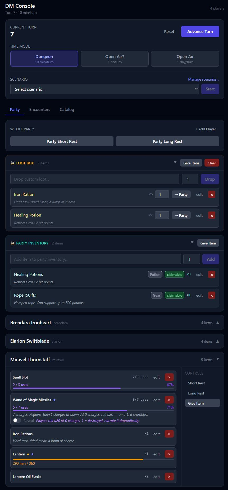
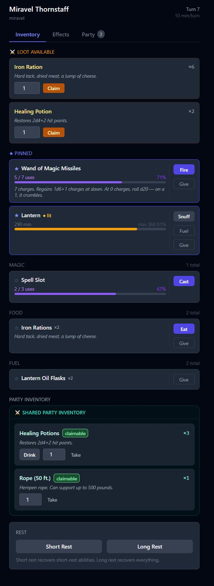
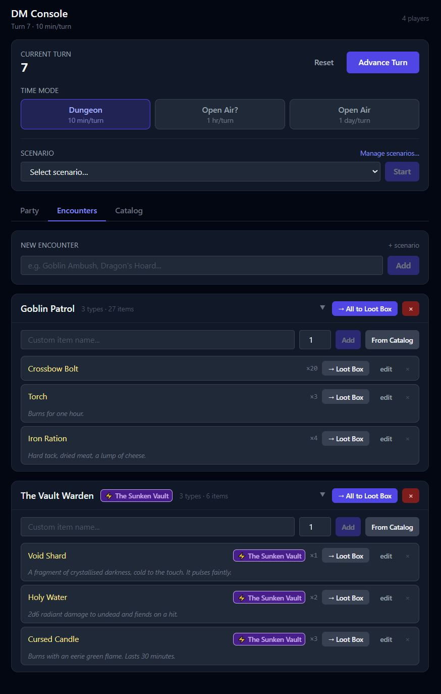
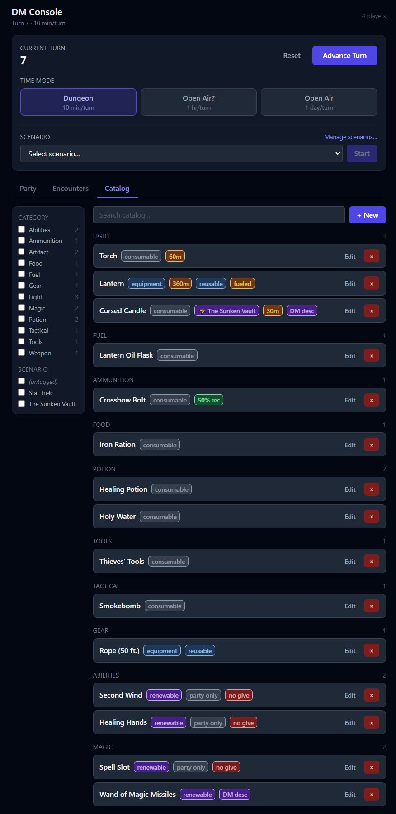
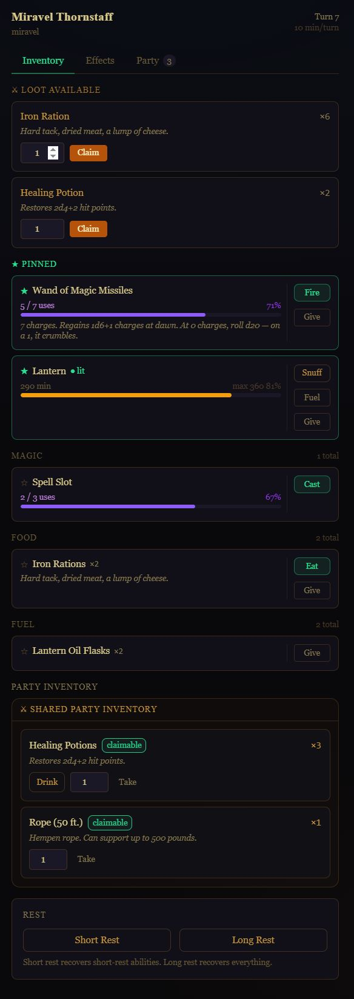
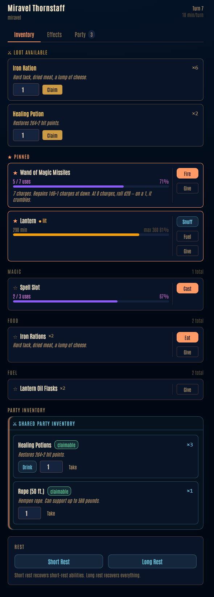

# DungeonRunner

**A real-time inventory and loot manager for your D&D table.**

No app stores, no subscriptions, no cloud syncing your session state somewhere you can't see it. It runs on one laptop on your home network. The DM gets a full control panel; players get their own live inventory on whatever device they have handy. Built because managing torches, spell slots, and loot drops in a spreadsheet is a slow, error-prone mess.

Runs on Windows and macOS. One `dotnet run`, one `npm run dev`.

<br>



*DM Console, Party tab: turn counter, time mode selector, scenario launcher, loot box ready to push to the party, shared party inventory, and per-player cards. Miravel's card is expanded — spell slots, wand charges, a lit lantern counting down, and a DM-only description revealed in italics.*

<br>

## Why I built this

Mid-session, the DM calls "you find a lantern and three oil flasks." Someone tries to update a shared Google Doc on their phone. Someone else crosses out a number in their notebook. Someone forgets entirely. The torch the ranger lit two rooms ago has been burning for forty-five minutes of real time — no one's tracking that either.

I wanted a system where the DM clicks once and every player's screen updates instantly. Where a lit torch actually counts down. Where loot goes from encounter → loot box → player inventory in three clicks.

So I built it.

<br>

## What it does

### Live inventory for every player

Each player connects from their own device — phone, tablet, laptop, whatever's on the table. Their inventory updates the moment the DM makes a change. No page refresh, nothing to poll.



*Player view (dark theme): loot available to claim at the top, pinned items (Wand of Magic Missiles 5/7 charges, lit Lantern with 290 of 360 minutes remaining), spell slots, rations, fuel, shared party inventory with claimable badges, and rest controls at the bottom.*

### Three item types with real rules

**Consumables** deplete when used and disappear at zero — torches, rations, bolts, potions. Bolts can have a recovery chance (50% come back after combat). Timed consumables actually burn: a torch lit now has 60 minutes on it, ticking down with every dungeon turn the DM advances.

**Equipment** toggles between lit and snuffed. Lit equipment decays with every turn. A lantern running on its last oil flask shows exactly how many minutes of light remain and accepts fuel items to top back up.

**Renewables** track charges separately from item count — spell slots, wand charges, Healing Hands, Second Wind. Assign a rest type (short, long, or both) and the charges refill automatically when the DM calls a rest.

### The loot box

Monsters drop loot, the DM pushes it to the loot box, players claim what they want to their own inventory or push it to the shared party pool. Per-item control over whether something is player-claimable or party-only — a quest artifact or Void Shard goes straight to the group.

### Encounters

Build reusable encounter templates in the DM panel. "Goblin Patrol" has 20 bolts, 3 torches, 4 rations — push everything to the loot box in one click, or send items individually. Encounters can be tagged to a scenario so the right loot shows up at the right time.



*Encounters tab: "Goblin Patrol" (20 crossbow bolts, 3 torches, 4 rations) and "The Vault Warden" tagged to The Sunken Vault scenario (Void Shard, Holy Water, Cursed Candles). Each item has its own → Loot Box button; the header button sends everything at once.*

### Turn counter and time tracking

The DM advances turns. Every lit item decays on advance. Dungeon mode ticks 10 minutes per turn; Open Air ticks 1 hour; Open Air (day) ticks 1 day. Switch modes mid-session. Players see exactly how much burn time their light sources have left.

### Catalog

Every item starts as a template. Templates set all the defaults: type, burn time, max charges, fuel relationships, recovery type, player-facing description, and a DM-only description the DM can optionally reveal mid-session. Give items from the catalog directly to players, or build encounters from it. Upload a PNG icon for any template.



*Catalog tab: templates grouped by category, filtered by category or scenario in the left sidebar. Badges show item type, burn time (60m, 360m, 30m), recovery chance (50% rec), scenario tag (The Sunken Vault), DM desc, reusable, fueled, party-only, and no-give flags at a glance.*

### Scenarios

A scenario is a named overlay — "The Sunken Vault," "Star Trek One-Shot." Activating one filters every player's view to only show items tagged to that scenario. A scenario can also force a theme on every connected client. Ending it purges scenario-tagged instances but leaves catalog templates intact for next time.

### The Fate Die *(coming soon)*

A d6 artifact the DM gives to a player. All six faces start blank. When they roll and land on a blank, they inscribe any effect — which triggers immediately and fills that face. Once all six fill, the die passes back to the DM. Then the DM calls the debt, rolling each player's die against them one face at a time. Backend domain logic is complete; hub wiring and frontend UI are in progress.

<br>

## Themes

Three themes, cycled with the button in the bottom-right corner of any screen. Any scenario can force a theme on every connected client while it's active.



*Hallowdown theme: near-black background, green glow accents, Cinzel / Crimson Pro serif fonts. Same inventory, different atmosphere.*

<br>



*LCARS theme: deep navy, amber primary, cyan party items, Antonio font. Pair with a Star Trek scenario for the full effect.*

| Key | Aesthetic |
|-----|-----------|
| `hallowdown` | Dungeon-horror — near-black, green glow, Cinzel / Crimson Pro serif |
| `dark` | Default dark slate |
| `lcars` | SNW Enterprise — navy, amber / cyan / magenta, Antonio font |

Adding a theme is one `[data-theme="yourkey"] { --t-*: ... }` block in `index.css` and an optional entry in `THEMES[]` in `App.tsx`.

<br>

## Quick start

**Prerequisites:** [.NET 9 SDK](https://dotnet.microsoft.com/download) and [Node.js 18+](https://nodejs.org/).

**1. Start the backend**

```bash
cd DungeonRunner/DungeonRunner
dotnet run
```

The server starts on `http://localhost:5000`. On first run it creates a `Data/` folder next to the binary and writes state there as you play.

**2. Start the frontend**

```bash
cd dungeon-runner-ui
npm install
npm run dev
```

Vite serves on `http://localhost:5173` and proxies SignalR (`/gamehub`) and item icons (`/icons`) to the backend automatically.

**3. Connect**

| Who | URL |
|-----|-----|
| Dungeon Master | `http://localhost:5173/dm` |
| Player `elarion` | `http://localhost:5173/elarion` |
| Player `sable` | `http://localhost:5173/sable` |

The app auto-joins on load — no login screen. Share the server's LAN IP (`http://192.168.x.x:5173/<userId>`) with players on the same network. The DM assigns character names after everyone has connected via **Create Player** in the DM panel.

<br>

## Sample data

A complete mid-session example lives in [`sample-data/`](sample-data/). Four players, turn 7 in dungeon mode, a running lantern, depleted wand charges, a pre-built encounter, and a locked scenario ready to activate. This is what the screenshots above are showing.

| userId | Character | Flavour |
|--------|-----------|---------|
| `elarion` | Elarion Swiftblade | Fighter / Scout |
| `miravel` | Miravel Thornstaff | Wizard |
| `sable` | Sable Nightwhisper | Rogue |
| `brendara` | Brendara Ironheart | Cleric |

To load it, copy the files into the backend's runtime `Data/` directory before starting the server:

```bash
cp -r sample-data/* DungeonRunner/DungeonRunner/bin/Debug/net9.0/Data/
```

No data at all is also fine — the server creates empty state on first run.

<br>

## How it's built

- **C# + ASP.NET Core** — the whole backend. `dotnet run` and it's live, no setup beyond the SDK. Game logic, state, file I/O — all in one place, no ORM, no database server.

- **SignalR** — real-time pub/sub over WebSockets. Every item use, loot drop, turn advance, or scenario change broadcasts immediately to every connected client. Hub methods are deliberately thin — call a service, broadcast the result, save. Typically five to ten lines each.

- **React 18 + TypeScript** — player and DM frontends. Component tree is flat and feature-oriented rather than deeply nested.

- **Vite** — dev server with hot module replacement. `host: true` exposes it on all LAN interfaces so players can connect from their phones without any extra config. Proxies `/gamehub` and `/icons` to the backend.

- **Zustand** — global client state. All SignalR event handlers live in one store; components subscribe to the slices they need. I looked at Redux briefly and immediately looked away.

- **Tailwind CSS** — three full themes built on CSS custom property tokens under `data-theme` attributes. The Tailwind classes reference the token variables rather than hardcoded colours, so the same markup works across all three themes.

- **`@microsoft/signalr`** — the official SignalR JS client. Reconnection, negotiation, and WebSocket/long-poll fallback are all handled automatically.

- **Flat JSON on disk** — all state is six JSON files in `Data/` plus one per player in `Data/users/`. Every write calls `SaveAllAsync()`. No database to install, no migrations, no connection strings. Missing files at startup default to empty collections via `?? new()` throughout `LoadAll()` — so you can delete the whole `Data/` folder and the server starts clean.

- **PNG icons as static files** — uploaded through the SignalR hub (base64, 256 KB cap, PNG magic-byte validated), written to `Data/icons/`, served at `/icons/` by ASP.NET's static file middleware. Cache-busted with `?v={ticks}` on the URL.

<br>

## Data and privacy

The backend makes no outbound requests. Everything stays on your machine and your LAN. Back up the `Data/` folder like any folder you care about — that's your whole campaign.

Pushing to GitHub without `Data/` is safe. The server creates it on first run. To run separate campaigns, use separate install directories.

<br>

## Developer notes

The full SignalR contract, DTO schema, domain model, rule engine behaviour, Fate Die lifecycle spec, and list of intentionally deferred work are in [`HANDOFF.md`](HANDOFF.md).

---

*Built for personal use and shared as-is. PRs welcome.*
