# Jason Hall — Portfolio

So you're about to see a bit of what goes on behind the curtain.

These are my passion projects, all built with AI-assisted coding, all solving a real problem I actually had. Some of them could solve business needs. Some of them exist because I wanted a specific thing that didn't exist yet and I knew I could build it. Hard problems are interesting to me. I don't stop when it gets complicated.

I've split them into two honest categories.

---

## Life Improvers

The tools that run on my machine and make day-to-day life meaningfully better.

---

### Pursuits — Job Search CRM &nbsp;&nbsp; [→ View Project](./Pursuits-Job-CRM/)

Spreadsheets turn into a mess by week two. Commercial CRMs want a monthly fee and put your data on their servers. I wanted something that felt like a real tool, worked offline, and let me actually own my history, including the notes from a recruiter call six weeks ago that I'd otherwise forget completely.

So I built a tight, low-resource CRM that runs locally. Seven pipeline stages. Staleness badges that turn red when you've gone quiet on an application. A notes timeline where logging a call resets the staleness clock. A search bar that reaches into note text, not just company names. And if you have an Anthropic API key, you can paste any job description and it fills the form automatically: company, role, salary, location, work mode. One click.

**Stack:** Python / Flask / HTMX / Tailwind CSS / Chart.js / JSON on disk

The entire interactive frontend (live search, inline status changes, note submissions, file uploads) runs through HTML attributes rather than a JavaScript framework. The whole app is a handful of JS lines.

| | |
|---|---|
| 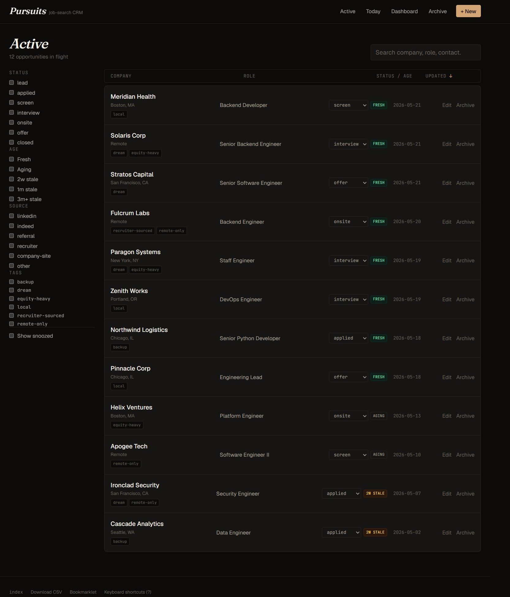 | 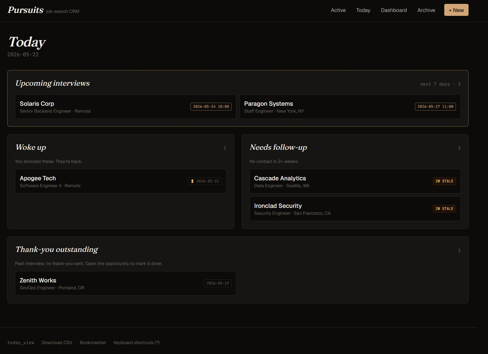 |
| 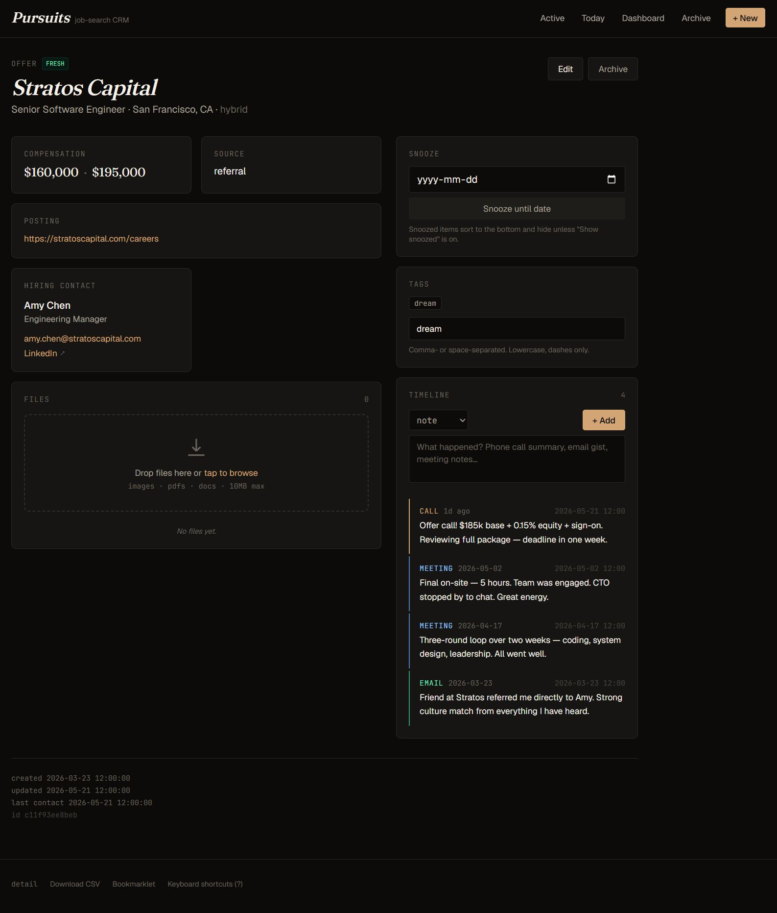 | 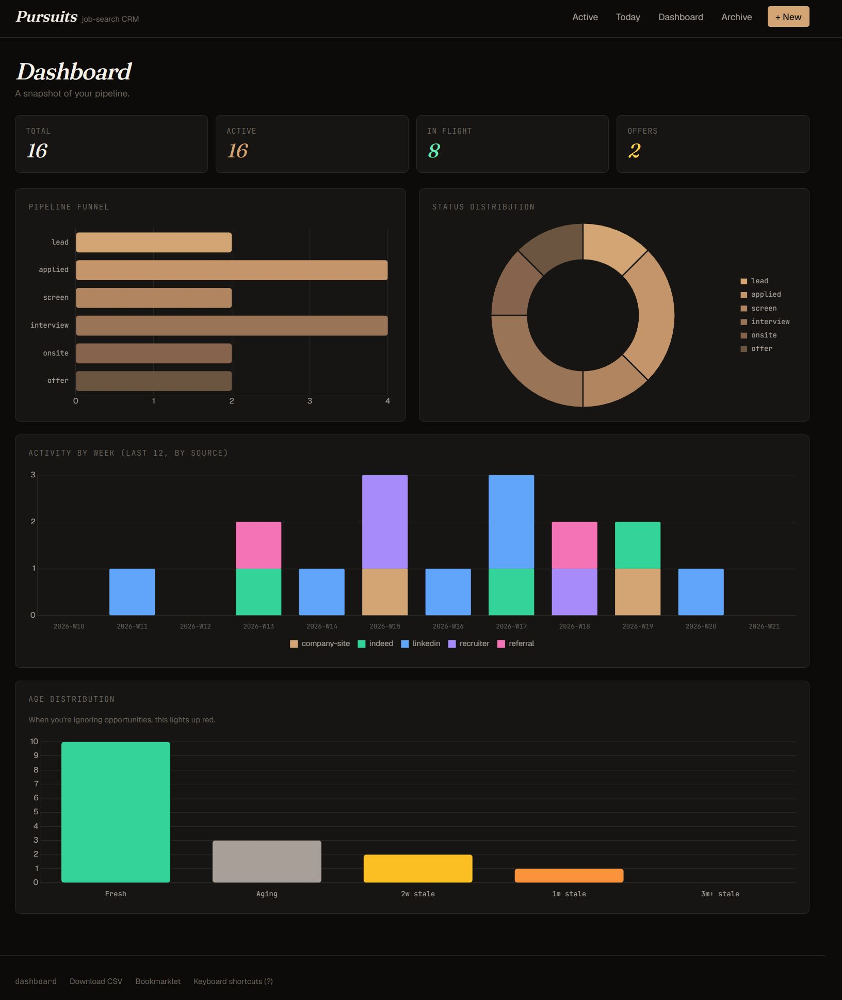 |
| 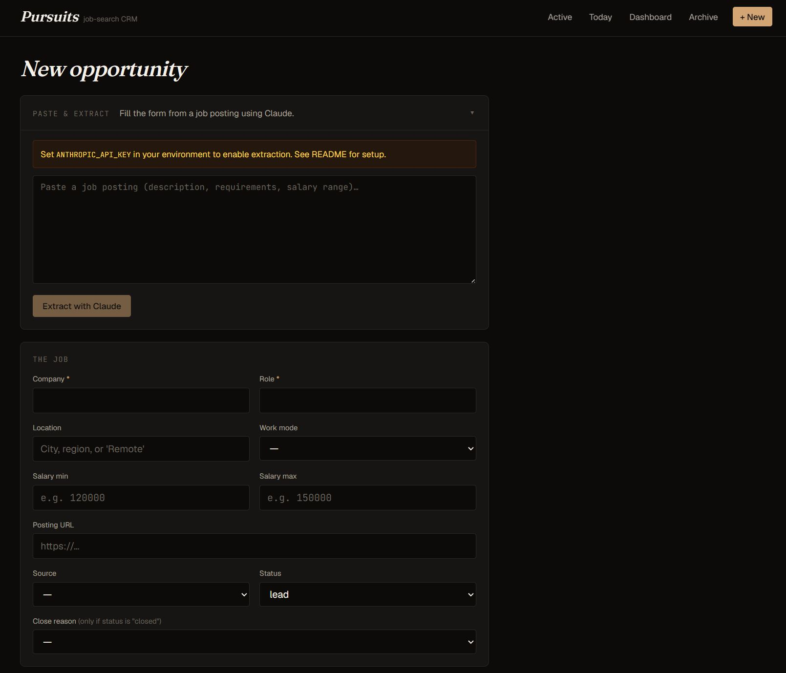 | 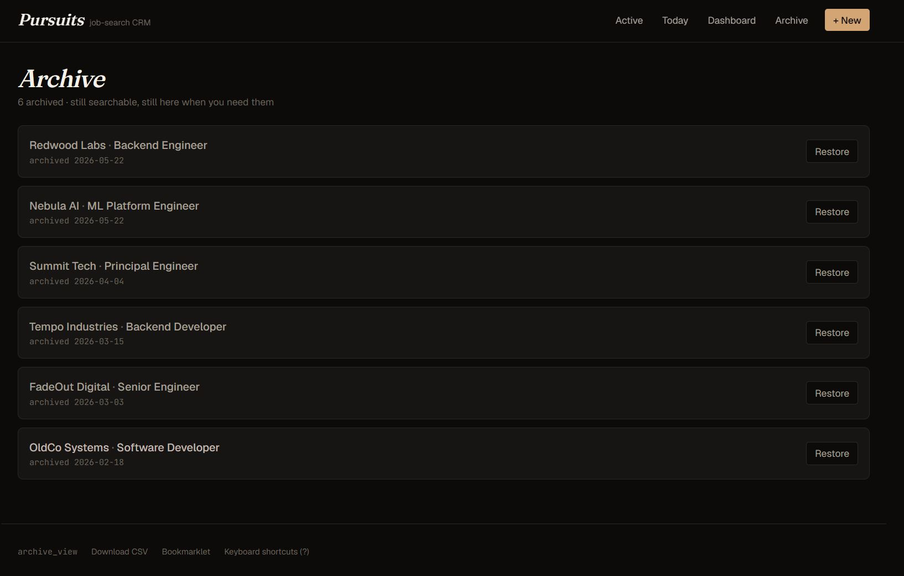 |
| 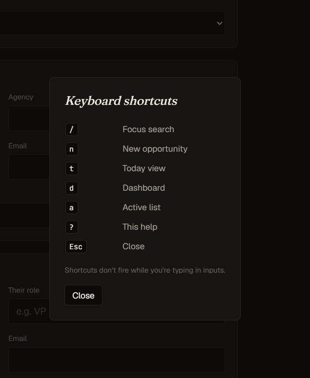 | |

---

### IRONLOG — Fitness Tracker and Voice Assistant &nbsp;&nbsp; [→ View Project](./TotallyNotJarvis-Personal-Assistant/)

The math behind a 5/3/1 program is fixed: take your training max, apply known percentages, get told what to lift. Paying $15 a month for that to happen in a cloud somewhere doesn't make sense. I built the tracker myself. Four lifts, automatic warmup sets, working sets, plate math, AMRAP tracking, and training maxes that increment at the end of each cycle without you touching anything.

The voice pipeline goes like this: tap to record, Whisper transcribes locally on your machine, Claude reads the intent, and Piper reads the response back. Say "remind me to call the physio on Monday" and a task is created with the due date parsed from natural language. Say "nine reps on the deadlift AMRAP, back felt solid" and it attaches to the current workout as a note. The whole thing takes a few seconds. And yes, it responds in a voice that sounds like J.A.R.V.I.S. from the Iron Man movies.

I use it handsfree on the way to the gym, driving, and walking the dogs. I don't have the flying suit yet, so I need to work on that.

**Stack:** Node.js / Express / React / TypeScript / Vite / Python / faster-whisper / Piper TTS / Claude API / PWA / Tailscale

Runs on a home PC, accessible from a phone over a private Tailscale network. No app store, no subscription, no cloud sync.

| | |
|---|---|
| 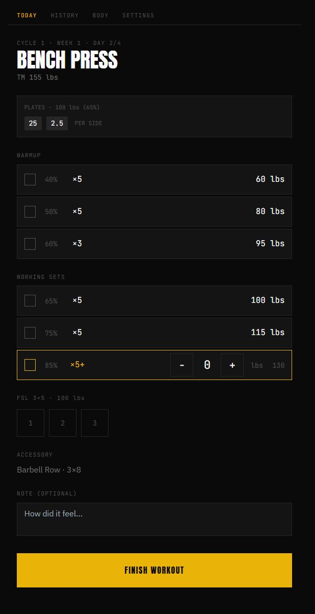 | 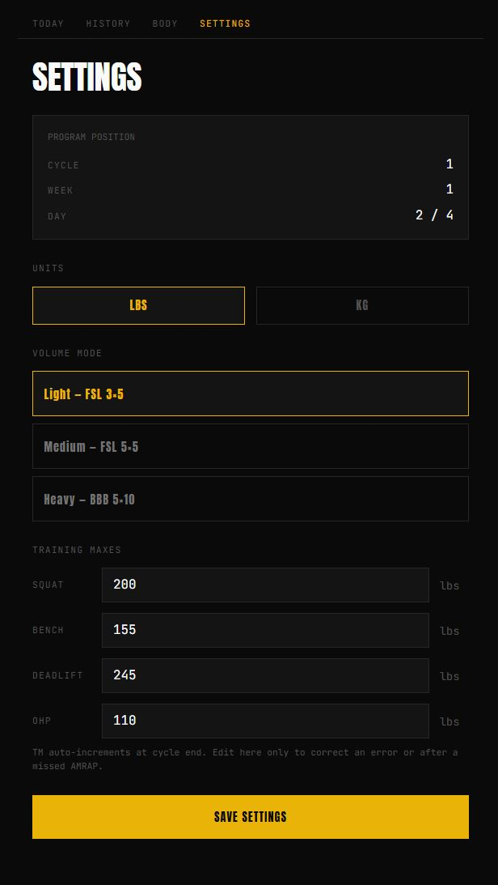 |
| 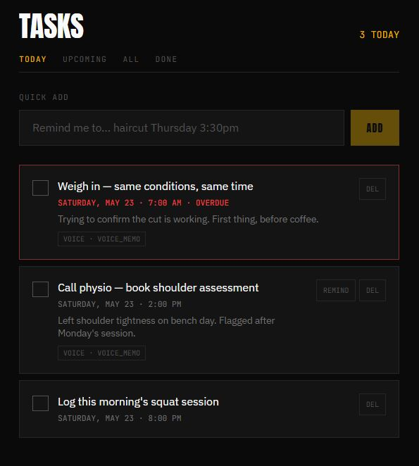 | 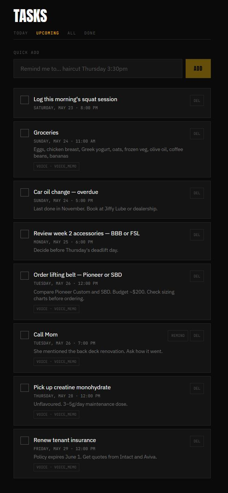 |
| 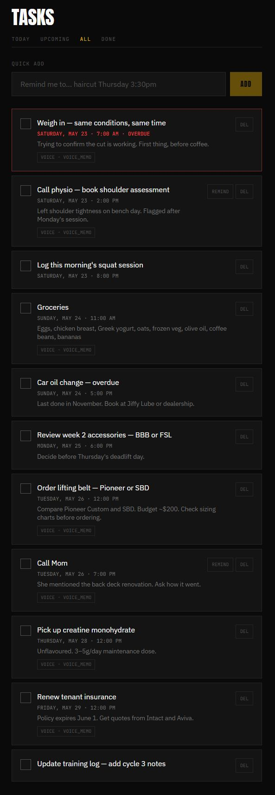 | 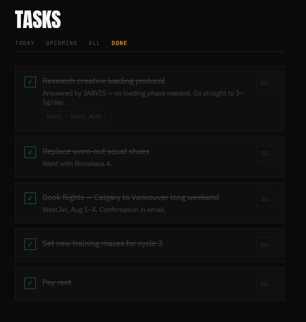 |
| 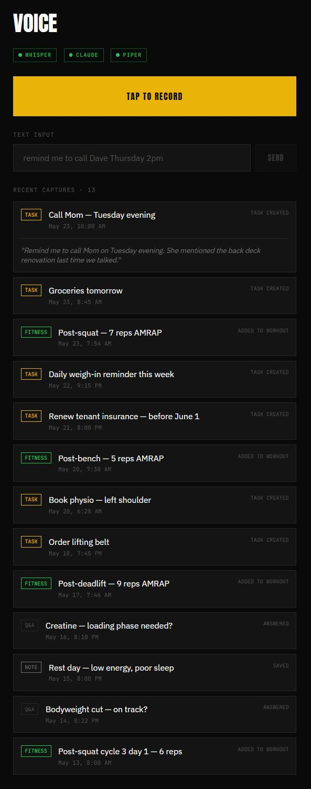 | |

---

## Nerdy Pursuits

*Passion projects to facilitate the geeky side of things.*

---

### DungeonRunner — D&D Inventory and Loot Manager &nbsp;&nbsp; [→ View Project](./DungeonRunner-DnD-Consumables/)

Two of my long-time friends moved away from Calgary. I wanted a way to stay in touch that was actually fun, and running an old-school Dungeons and Dragons game virtually felt like the right answer. But managing torches, spell slots, and loot drops in a shared Google Doc on someone's phone mid-session is a slow, error-prone mess.

I built DungeonRunner to give the DM full control over each player's inventory, while players connect from their own device and see every change the moment it happens. Every screen updates on a single click.

The interesting engineering is in the item rules. A torch lit now has 60 minutes on it, counting down as the DM advances turns. A lantern accepts specific fuel items and shows exactly how many minutes of light remain. Wand charges track separately from item count and refill based on whether you took a short rest or a long one. Loot flows from encounter template to loot box to player inventory in three clicks.

Three full visual themes: dark slate for a regular game, dungeon-horror green for a horror session, and a full LCARS Enterprise aesthetic for the Star Trek one-shot. Because of course.

**Stack:** C# / .NET 9 / ASP.NET Core / SignalR / React / TypeScript / Zustand / Tailwind CSS

| | |
|---|---|
|  |  |
|  |  |
|  |  |

---

### Starship Simulation — Real-Time Space Economy and Combat &nbsp;&nbsp; [→ View Project](./starship/)

I'm building the game I want to play.

A multiplayer space simulation built on an Entity Component System architecture. Ships, stations, trade routes, combat, and jump gates all emerge from components attached to entities. There are no hardcoded ship types. The C# server owns all state and runs everything at 20 times per second. The React admin dashboard and Unity 3D client are both dumb views of its state.

Currently at Stage 4 of 10. The economy runs: a multi-tier production chain from iron ore through smelting, fabrication, and missile assembly, with logistics ships scoring and bidding on trade routes every 5 seconds. A* pathfinding and the jump gate network are operational. The React admin interface lets you inspect entities, edit components live, and spawn ships by clicking the map. Unity client integration has started.

The WebSocket protocol is frontend-agnostic from day one. Unity, React, and anything else consume the same three streams. The plan is for Unity to eventually be the primary gameplay client, with the React dashboard staying on as the developer and admin tool.

**Stack:** C# / .NET 8 / ASP.NET Core / WebSockets / React / TypeScript / Vite / Unity 2022 LTS

| | |
|---|---|
|  |  |
|  |  |

---

### Ask Me Anything — Anonymous Community Q&A &nbsp;&nbsp; [→ View Project](./AskMeAnything-Chatboard/)

A proof-of-concept anonymous bulletin board, built to show that a full-featured web application doesn't have to be complex to deploy. The entire thing, Flask backend and React frontend, lives in one Python file. Two commands and it's running.

Posts and answers show a random ID, not a real name. Topics require admin approval before they go live. Voting is toggle-aware. The whole interaction model is visible and auditable in a single sitting.

Built on the same structural model as early Reddit: topic-based boards, threaded answers, community voting, moderation controls. The README is honest about every limitation and includes a step-by-step path to production if someone wanted to take it there.

**Stack:** Python / Flask / React 18 (CDN, no build step) / Tailwind CSS / JSON on disk

| | |
|---|---|
|  |  |
|  | |

---

## How I Integrate AI Into the Process

Every project started out traditionally: a design doc, a tech stack audit, a problem definition. Break the objectives down into workable chunks, finish one, move to the next.

Where AI changes the equation is execution. Once the architecture is clear and the constraints are written down, the gap between "I know exactly what this should do" and "it's running" gets a lot shorter. I can describe a system I've already reasoned through and get working code back that I can read, verify, and extend. The judgment about whether it's right is still mine. The hours of typing it out, less so.

The result is that these projects are more ambitious than they'd otherwise be in the same amount of free time. A real-time ECS simulation with a full economy, pathfinding, and a Unity client in parallel is a lot of surface area for a solo side project. It's doable because I know what I'm building and AI handles a meaningful share of the implementation work.

What I bring: system design, architectural decisions, knowing when a choice is wrong, domain knowledge (fitness programming, D&D rules, job search workflows, game simulation mechanics), and the judgment calls that don't have an obvious answer. What AI brings: speed on the implementation side, a second pass on things I've already reasoned through, and less time spent on the parts of coding that are mechanical rather than interesting.

---

## Tech Across the Portfolio

| | Technologies |
|---|---|
| **Backend** | C# / .NET 8–9, ASP.NET Core, Python / Flask |
| **Frontend** | React 18–19, TypeScript, Vite, Tailwind CSS, HTMX, Zustand |
| **Real-time** | WebSockets, SignalR |
| **Local AI** | faster-whisper (transcription), Piper TTS (voice synthesis) |
| **Cloud AI** | Anthropic Claude API — scoped, single-purpose only |
| **Game client** | Unity 2022 LTS (in progress) |
| **Data** | JSON on disk, atomic writes, no ORM, no database server |
| **Networking** | Tailscale for private LAN-to-phone access |

---

All built in personal time. All shared as-is. PRs welcome if something seems broken or clearly worth improving.
