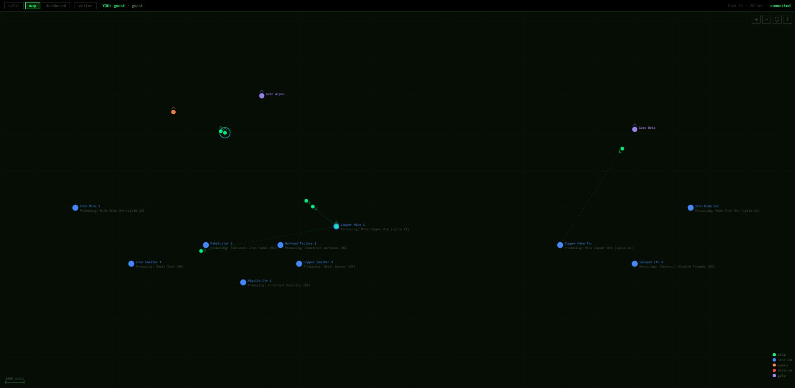
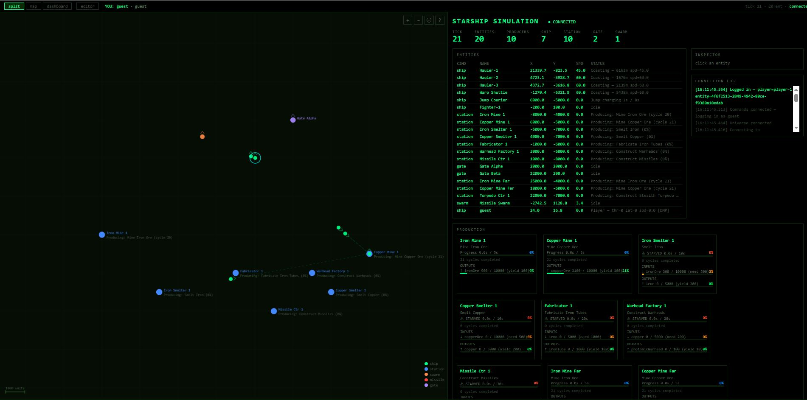
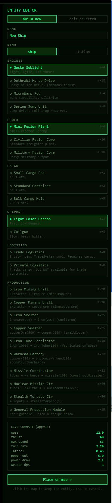
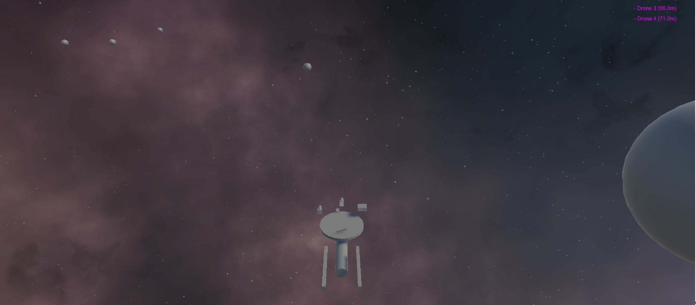

# Starship Simulation

An ECS-based multiplayer space simulation. The C# server is the single source of truth — all clients are dumb views of its state. Ships, stations, trade routes, combat, and jump gates emerge from components attached to entities; no hardcoded ship or station types exist.

**Primary client:** Unity (2.5D — 3D models locked to a 2D plane)
**Secondary client:** React/Vite admin dashboard (entity editor, debug tools, live map)

> **Status: Work in Progress — Stage 4 of 10**
> Economy, A\* pathfinding, and the React/Vite admin interface are operational. Unity client integration has begun.

---

## Screenshots

| | |
|---|---|
|  |  |
| *Universe map — ships and stations as colour-coded entities with live production status* | *Split view — entity list, production cards and connection log alongside the map* |
|  |  |
| *Entity editor — assemble a ship from the component catalogue, live stat preview updates in real time* | *Unity client (early integration) — station model, asteroid field, nebula and drone proximity HUD* |

---

## Roadmap

| Stage | Name | Key Deliverables | Status |
|---|---|---|---|
| **1** | **Core Architecture** | ECS framework, WebSocket triple-stream (state / events / commands), entity-component foundation, React admin skeleton | ✅ Done |
| **2** | **Universe & Simulation** | Spatial grid, Newtonian physics, 2D movement, 20 Hz tick loop, universe seeding (ships, stations, gates) | ✅ Done |
| **3** | **Navigation & Jump Gates** | A\* pathfinding, jump gate network, warp/sublight cost modelling, multi-hop route planning | ✅ Done |
| **4** | **Economy, Trade & Admin UI** | Production chains, resource registry, trade job matching, logistics ships; React/Vite admin interface (entity editor, debug dashboard, live universe map) — *Unity client integration begins* | 🔄 Current |
| **5** | **Combat & Weapons** | Full weapon/targeting pipeline, projectile lifecycle, damage model, fighter AI behaviour | 🔲 Planned |
| **6** | **Player Control & Multiplayer** | Server-authoritative piloting, dampeners, URL-based player identity, in-browser entity editor | 🔲 Planned |
| **7** | **Unity Client — Full Integration** | Unity renderer complete — 3D ship models, particle VFX, camera system, replaces React canvas for gameplay | 🔲 Planned |
| **8** | **Factions & Deep AI** | Faction relationships, territory, AI fleet decision-making, diplomacy, reputation | 🔲 Planned |
| **9** | **Persistence & Campaigns** | Universe save/load, player progression, persistent economy state, mission/contract system | 🔲 Planned |
| **10** | **Content Complete & Ship** | Full content pass, balance tuning, performance hardening, public deployment | 🔲 Planned |

---

## Architecture Overview

```
StarshipSimulation/
├── StarshipSimulation/
│   ├── StarshipSimulationShared/    # Contracts, entity definitions — no server/UI dependencies
│   ├── StarshipSimulation.Server/   # ASP.NET Core simulation host
│   └── StarshipSimulation.Renderer/ # Placeholder (future Silk.NET debug client)
└── StarshipSimulation.UI/           # React/Vite admin dashboard (secondary client)
```

**Core principle:** Entity → Components → Behaviour. Components are pure data holders. Systems contain all logic and operate over entity pools. `CommandHandler` is a pure network-to-component translator with zero game logic.

The protocol is **frontend-agnostic** — Unity, React, and Unreal all consume the same WebSocket streams.

### Three WebSocket endpoints

| Endpoint | Direction | Purpose |
|---|---|---|
| `/ws/universe` | Server → Client | 20 Hz delta state stream (`TickUpdate`) |
| `/ws/events` | Server → Client | Narrative events — combat, trade, faction actions |
| `/ws/commands` | Client → Server | Player input — movement, orders, log requests |

---

## Prerequisites

| Tool | Version |
|---|---|
| .NET SDK | 8.0+ |
| Node.js | 18+ |
| npm | 9+ |
| Unity | 2022 LTS+ (for primary client) |

---

## Getting Started

### 1. Start the server

```bash
cd StarshipSimulation/StarshipSimulation.Server
dotnet run
```

Server listens on `http://localhost:5000`.

### 2. Start the admin dashboard (React)

```bash
cd StarshipSimulation.UI
npm install
npm run dev
```

Vite opens at `http://localhost:5173`. The admin dashboard is for development and debugging — entity editing, economy monitoring, live universe map.

### Multiplayer — URL-based identity

The URL path becomes your player identity:

```
http://<server-ip>:5173/yourname
```

Each unique path is a separate player session. Sessions resume on page reload.

---

## Project Structure

### `StarshipSimulationShared` — shared library

Root namespace: `StarshipSimulation.Shared`. **Never references the Server project.**

```
Entities/
  Components/       # EngineModule, WeaponModule, CargoModule, PowerModule,
                    # ProductionComponent, LogisticsComponent, PlayerControlledComponent,
                    # ProjectileComponent, ShipStatsComponent, GateComponents, …
  Orders/           # Order, OrderStep, OrderType, StepType
Economy/            # ProductionRecipe, ResourceRegistry, TradeJob
Messages/           # ClientCommand, EntityState, TickUpdate, NarrativeEvent (wire DTOs)
Players/            # PlayerSession
```

### `StarshipSimulation.Server`

```
Simulation/
  Systems/          # MovementSystem, NavigationSystem, WeaponSystem, ProjectileSystem,
                    # TradeSystem, ProductionSystem, OrderSystem, TraversalPlanner
  UniverseService.cs   # Owns all entities, spatial grid, systems
  UniverseTicker.cs    # ASP.NET hosted service — drives macro/micro tick loop
  EntityPool.cs        # Pre-allocated pools (projectiles, fighters)
  SpatialGrid.cs       # Spatial hash for O(1) range queries
Networking/
  CommandHandler.cs         # WebSocket → component translation (no game logic)
  UniverseStream.cs         # State broadcast
  NarrativeEventStream.cs   # Event broadcast
Program.cs                  # DI setup + seed universe
```

### `StarshipSimulation.UI` — React admin dashboard

```
src/
  App.tsx                       # Root: keyboard input, layout modes (split/map/dashboard)
  components/
    UniverseMap.tsx             # Canvas renderer: entities, targeting, entity placement
    DebugDashboard.tsx          # Status panel, entity info, activity log
    EntityEditorPanel.tsx       # Spawn / edit entities with full component catalogue
  hooks/
    useUniverseWebSocket.ts     # WebSocket state sync + dead-reckoning interpolation
  assets/ships/                 # Coloured sprite sets (~15 colours)
```

---

## Key Systems

### Tick Loop

| Tick | Rate | Responsibility |
|---|---|---|
| Micro | 20 Hz (50 ms) | Physics, movement, position, wire stream |
| Macro | Every 5 s | Production, trade scheduling, order step execution |

Macro tick order: **ProductionSystem → OrderSystem → TradeSystem**

### Movement

Full Newtonian physics. Heading and velocity are fully decoupled — a ship can point one direction and move in another.

NPC ships follow a pre-computed **TraversalPlan** (4 phases: accelerate → coast → flip → brake) evaluated each micro tick via pure arithmetic — no integration drift. Player ships receive direct thrust commands from the client.

**Movement profiles:**

| Profile | Thrust | Speed | Arrives At | Use |
|---|---|---|---|---|
| Standard | 100% | 100% | Rest | Default logistics |
| Economy | 40% | 70% | Rest | Fuel conservation |
| Military | 100% | 100% | Cruise speed | Combat posture |

**Dampeners** decompose velocity into parallel/lateral components and fire the appropriate thruster to cancel drift. Off = Newtonian coast.

**Transit modes:**

| Mode | Mechanic | Cost |
|---|---|---|
| Sublight | Newtonian thrust | Hydrogen |
| Warp | Straight-line constant speed | Dilithium |
| Jump | Charge time → instant translate | Energy |
| Gate / Wormhole | Instant at location (full stop required) | — |

### Navigation & Routing

`NavigationSystem` runs Dijkstra over a unified graph (sublight, warp, gate, jump edges). Warp costs include `WarpChargeTime` to prevent gate-swinging over direct sublight. Results are LRU-cached per entity capability bucket (speed/warp/jump tiers). Cache holds up to 10,000 entries.

### Economy & Trade

**Production chain (current seed):**

```
Tier 0  Iron Mine → ironOre       Copper Mine → copperOre
Tier 1  Iron Smelter:    ironOre(500)  → iron(200)
        Copper Smelter:  copperOre(500) → copper(200)
Tier 2  Fabricator:      iron(1000)    → ironTube(100)
        Warhead Factory: copper(200)   → photonicWarhead(10)
Tier 3  Missile Centre:  ironTube(100) + photonicWarhead(10) → missile(100)
```

Recipe quantities are in **units** (not stacks). `StackSize` is a cargo slot constraint only: `slots = ceil(units / stackSize)`. Starved factories do not tick — no spurious progress.

**Trade scheduler** runs every macro tick: scores input bunker fill ratios, filters to needs that have a surplus provider, then token-passes available logistics ships by throughput (`deliverable_units / (leg1s + leg2s)`).

### Combat

`WeaponModule` is pure data (range, muzzle speed, projectile kind, `WantsToFire` flag). `WeaponSystem` owns fire logic, spawns projectile entities, and applies damage. `ProjectileSystem` handles drift and lifetime expiry.

**Targeting:** Press `T` on the client to cycle entities within `TARGET_CYCLE_RADIUS`. Sends `set_target` to server.

### Admin — Entity Editor

`EntityEditorPanel` builds new entities from a component catalogue (engines, power, cargo, weapons, logistics, production) or edits existing selected entities. Click **Place** then click the map to spawn. Production modules carry a runtime recipe via the `production:general:<recipeName>` spec.

---

## Seed Universe

`Program.cs` initialises a demo universe with:

- **Near region** — mines, smelters, fabricators, factories
- **Jump gates** — Gate Alpha ↔ Gate Beta connecting near and far regions
- **Far region** — high-output extraction
- **Fleet** — haulers, a warp shuttle (fast courier), a jump courier, a fighter, missile swarm

---

## Design Principles

1. **Commitment and consequence is the prime directive.** Speed costs fuel. Range costs charge time. Power costs mass. Every capability has a trade-off.
2. **Nothing is useless.** A 1-point reactor + jump drive is a valid deep-space scout. Every component has a build where it is the correct answer.
3. **Neutral state principle.** Systems act and reset. The loop finds you naturally on the next pass.
4. **Simulation is king.** The C# backend owns all state. Clients are dumb views.
5. **Everything is an entity.** No hardcoded types. Behaviour emerges from components.
6. **Server calculates, client narrates.** Outcomes are instant on the server; Unity tells the story.
7. **Swarms over individuals.** Groups are one entity with attrition, not N individual entities.
8. **Frontend agnostic.** Clean WebSocket protocol makes clients interchangeable.
9. **Pool before you spawn.** Combat entities are pre-allocated.
10. **Physics are absolute — except when a plan suspends them.** Coasting requires a deliberate waypoint plan.

---

## Development Notes

### Hard constraints

- `StarshipSimulationShared` must **never** reference the Server project. Any behaviour needing `UniverseService` belongs in a System.
- `CommandHandler` is a translator only — no game logic.
- `MovementSystem` never clears `CurrentOrder` — that belongs to `OrderSystem.CompleteOrder()`.
- All `JsonSerializerOptions` must set `IncludeFields = true` — `System.Numerics.Vector2` uses fields, not properties; the serialiser skips them otherwise.
- Recipe quantities are units not stacks. `StackSize` is cargo only.
- Starved factories must not tick — check inputs before accumulating progress.

### Open questions

- [ ] Universe shape — bounded, infinite, or sectored/sharded?
- [ ] Server topology — single universe vs instanced regions
- [ ] PowerSystem — energy distribution enforcement (currently unenforced)
- [ ] Observer system — sensor range driving micro/macro tick boundary
- [ ] Warp/Jump transition ramps — enter/exit (sublight ramp vs fixed module duration vs hybrid); currently engages/exits instantly
- [ ] Wormhole mechanics — discovery, stability, collapse
- [ ] Serialisation — JSON now, MessagePack at scale
- [ ] Hardpoint inventory — grid-based vs slot-based
- [ ] Fuel scarcity tuning — hydrogen abundance, dilithium rarity
- [ ] Dwell time in trade ETA bidding — currently ignored in throughput maths
- [ ] Component removal in entity editor — needs `ComponentId` on `EntityState.componentSummary`

---

## Tech Stack

| Layer | Technology |
|---|---|
| Server | C# / .NET 8, ASP.NET Core, WebSockets |
| Shared | C# class library (no framework dependencies) |
| Primary client | Unity 2022 LTS+ (2.5D) |
| Admin client | React 19, TypeScript 5.9, Vite (rolldown), SignalR 10 |
| Physics | `System.Numerics.Vector2` |
